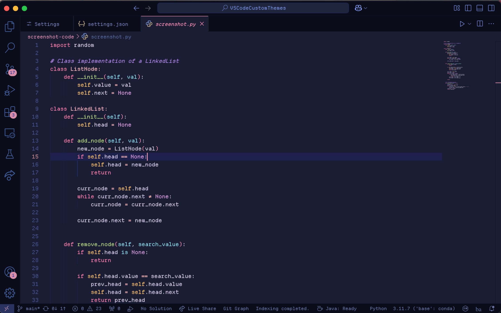
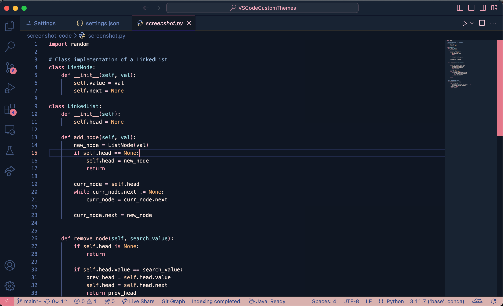
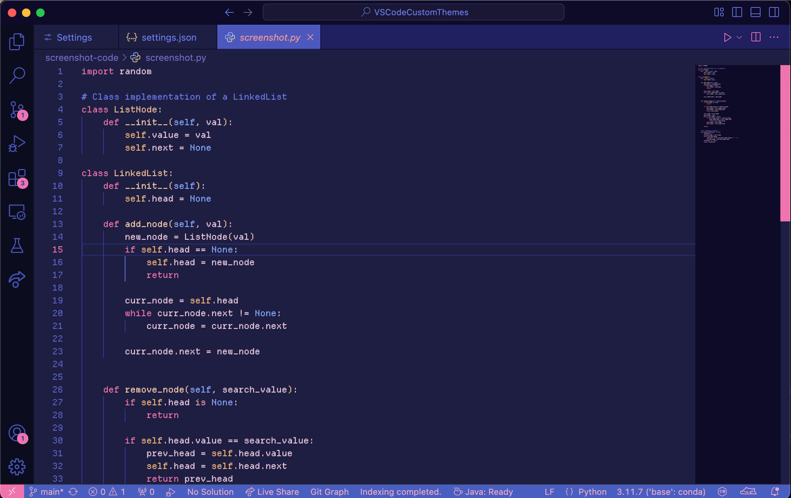
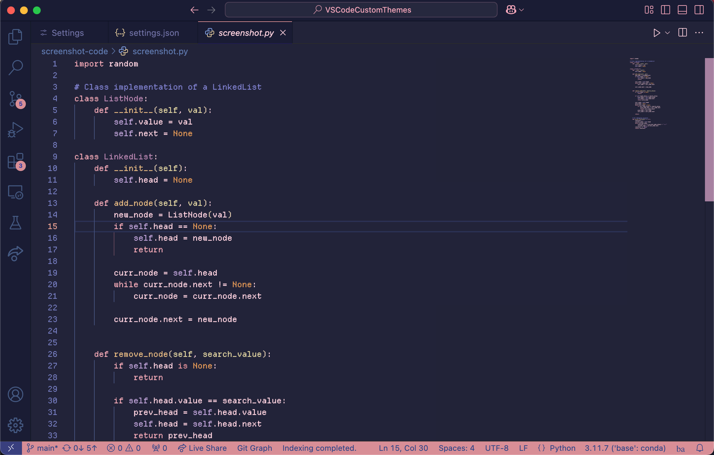
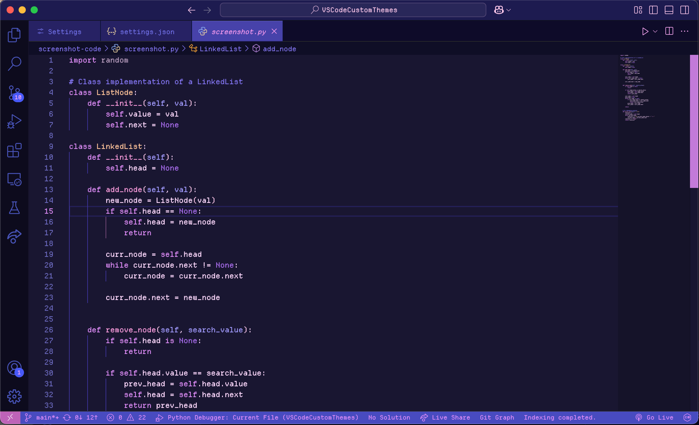
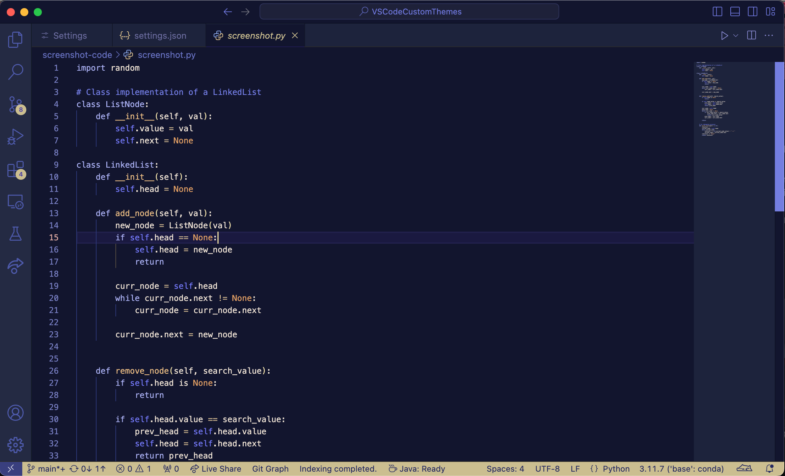

## About
This theme extension aims to capture the common color schemes of the citypop or lofi aesthetic. Currently, there are about 6 variations, each following the idea of times. Feel free to make suggestions or requests on the Issues tab on Github!

## Previews

    
Default

    

    
Dawn

    

    
Day

    

    
Sunset

    

    
Dusk

    

    
Night

    

    
Midnight

    

## Other Customizations
### Icons
1) Try out [Catppuccin Icons](https://marketplace.visualstudio.com/items?itemName=Catppuccin.catppuccin-vsc-icons) for VSCode!

2) Also works well with: [Sweet VSCode Icons](https://marketplace.visualstudio.com/items?itemName=EliverLara.sweet-vscode-icons)

### Font Settings
If you want to try programming fonts, [NerdFonts](https://www.nerdfonts.com/font-downloads) has many you can preview and download. Many of these fonts provides ligature support. However, if you don't want to go into the rabbit-hole of fonts, here are some I've tried out!

#### Ligature Support 
1. (Github) Popular one: [FiraCode](https://github.com/tonsky/FiraCode?tab=readme-ov-file)
2. (Website) Comes with 5 variations: [Monaspace](https://monaspace.githubnext.com/)
3. (Github) Used in Visual Studio: [Cascadia Code](https://github.com/microsoft/cascadia-code)
4. (Website) Allows extensive customization, but on the smaller side: [Iosevka](https://typeof.net/Iosevka/)
5. (Github) A round, clean font similar to Cascadia Code: [Maple](https://github.com/subframe7536/maple-font)

#### Less Ligature Support
1. (Github) If you like thin letters: [Victor Mono](https://github.com/rubjo/victor-mono)
2. (Website) If you like small compact letters: [Mononoki](https://madmalik.github.io/mononoki/)

#### No Ligature Support, But Fits the Theme
1. (Website) Pixelated Lofi-vibes : [Departure Mono](https://departuremono.com/)
2. (Website) 8-bit font: [Gohu](https://font.gohu.org/)