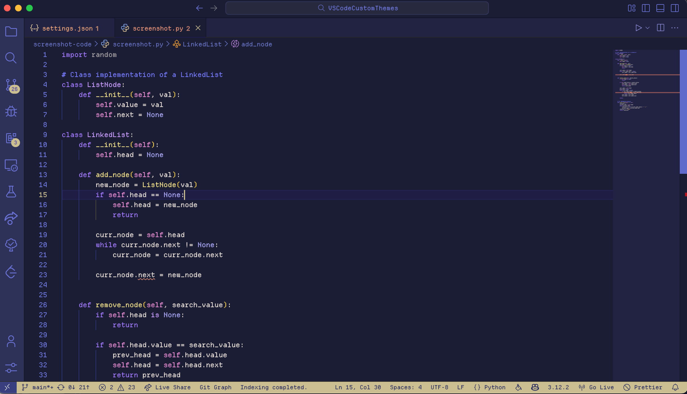

## About
When I first started developing a theme for my VSCode, I figured it would be a one-time thing and made my first theme with overly saturated blues and pinks. It didn't look good AT ALL. But before I knew it, I became obsessed with having all kinds of color schemes on my editor, from pastels like Catppuccin's Theme to bold, saturated colors in Shades of Purple. 

This collection takes inspiration from popular themes and combines them with color schemes from citypop and lofi imagery. These colors may not be conventional for long periods of coding, and yes, they may take some time getting used to. The whole point of a theme is to have fun, so enjoy making different colors pop up as you code. Happy developing! ╰(*´︶`*)╯

## Previews
<details>
    <summary>Default</summary>
    
</details>

<details>
    <summary>Blue Hour</summary>
    
</details>

<details>
    <summary>Sunrise</summary>
    
</details>

<details>
    <summary>Dawn</summary>
    
</details>

<details>
    <summary>Day</summary>
    
</details>

<details>
    <summary>Noon</summary>
    
</details>

<details>
    <summary>Golden Hour</summary>
    
</details>

<details>
    <summary>Sunset</summary>
    
</details>

<details>
    <summary>Twilight</summary>
    
</details>

<details>
    <summary>Dusk</summary>
    
</details>

<details>
    <summary>Night</summary>
    
</details>

<details>
    <summary>Midnight</summary>
    
</details>

<details>
    <summary>Witching Hour</summary>
    
</details>

## Other Customizations
### Icons
1) Try out [Catppuccin Icons](https://marketplace.visualstudio.com/items?itemName=Catppuccin.catppuccin-vsc-icons) for VSCode!

### Font Settings
If you want to try programming fonts, [NerdFonts](https://www.nerdfonts.com/font-downloads) has many you can preview and download. Many of these fonts provide programming ligatures. However, if you don't want to go down the rabbit-hole of fonts, here are some I've found to be popular:

#### Ligature Support 
1. (Website) Comes with 5 variations: [Monaspace](https://monaspace.githubnext.com/)
2. (Github) A round, clean font similar to Cascadia Code: [Maple](https://github.com/subframe7536/maple-font)
3. (Github) If you like thin, tall letters: [Victor Mono](https://github.com/rubjo/victor-mono)

#### No Ligature Support 
1. (Website) **Recommended for this theme** (used in screenshots): [Departure Mono](https://departuremono.com/)
2. (Website) If you like small compact letters: [Mononoki](https://madmalik.github.io/mononoki/)

## Inspirations
1. Default: [Gruvbox](https://marketplace.visualstudio.com/items?itemName=jdinhlife.gruvbox)
2. Blue-Hour: [Blueberry Dark](https://marketplace.visualstudio.com/items?itemName=peymanslh.blueberry-dark-theme)
3. Sunrise: [Catppuccin](https://marketplace.visualstudio.com/items?itemName=Catppuccin.catppuccin-vsc) and [FairyFloss](https://marketplace.visualstudio.com/items?itemName=mintchipleaf.fairyfloss)
4. Dawn: [City Fog](https://marketplace.visualstudio.com/items?itemName=metalloriff.city-fog)
5. Day: [Pink Cat Boo](https://marketplace.visualstudio.com/items?itemName=ftsamoyed.theme-pink-cat-boo)
6. Dusk: [Gruvbox ish](https://marketplace.visualstudio.com/items?itemName=GracefulPotato.gruvbox-ish)
7. Noon: [Shades of Purple](https://marketplace.visualstudio.com/items?itemName=ahmadawais.shades-of-purple) and [SynthWave '84](https://marketplace.visualstudio.com/items?itemName=RobbOwen.synthwave-vscode)
8. Golden Hour: [PastelWater](https://marketplace.visualstudio.com/items?itemName=AndreaCombette.PastelWater)
9. Sunset: [Monokai Pro](https://marketplace.visualstudio.com/items?itemName=monokai.theme-monokai-pro-vscode)
10. Twilight: [Rose Pine](https://marketplace.visualstudio.com/items?itemName=mvllow.rose-pine)
11. Midnight: [Pastel Pink Theme](https://marketplace.visualstudio.com/items?itemName=skrewbar.pastel-pink-theme) and [Japanese City Pop](https://marketplace.visualstudio.com/items?itemName=wu-chinese.japanese-city-pop)
12. Witching Hour: [Tokyo Night](https://marketplace.visualstudio.com/items?itemName=enkia.tokyo-night) and [1984](https://marketplace.visualstudio.com/items/?itemName=juanmnl.vscode-theme-1984)

<!-- ### Italics
Some themes contain italics to differentiate comments from the rest of the code. To change this, you can go to your settings.json and add:
```
"editor.tokenColorCustomizations": {
  "textMateRules": [
    {
      "name": "No italics",
      "scope": ["comment"],
      "settings": {
        "fontStyle": "normal"
      }
    }
  ]
}
```
To add italics, change "fontStyle" from "normal" to "italic". -->

<!-- ### Default

### Dawn

### Day

### Sunset

### Dusk

### Night

### Midnight

### Witching Hour
 -->