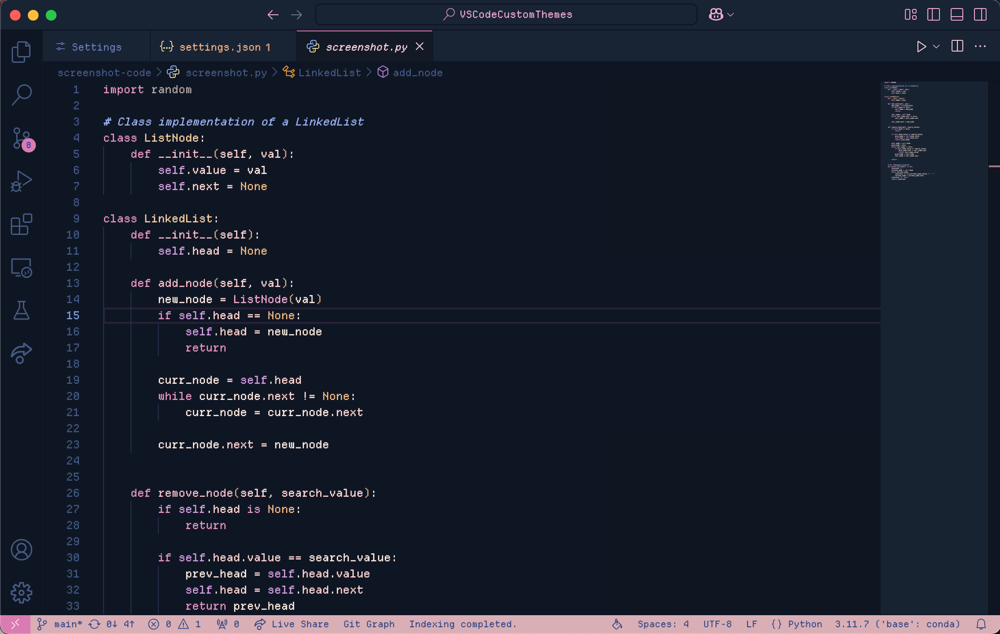

## About
This theme extension aims to capture the common color schemes of the citypop or lofi aesthetic. Currently, there are about 5 variations, each following the idea of times. Feel free to make suggestions or requests on the Issues tab on Github!

## Previews

    
Default

    

    
Day

    

    
Dusk

    

    
Night

    

    
Midnight

    

If you want to see some more themes I've made, you can see them all here!

## Other Customizations
### Icons
1) Try out [Catppuccin Icons](https://marketplace.visualstudio.com/items?itemName=Catppuccin.catppuccin-vsc-icons) for VSCode!

### Font Settings
If you want to add some custom fonts, here are some recommendations for some basic fonts (there are a lot more free ones you can try out!):

The one I'm currently using: [Monaspace](https://monaspace.githubnext.com/)

Another one I like: [Victor Mono](https://github.com/rubjo/victor-mono)

Many people like this one: [FiraCode](https://github.com/tonsky/FiraCode?tab=readme-ov-file)

Used in Visual Studio: [Cascadia Code](https://github.com/microsoft/cascadia-code)