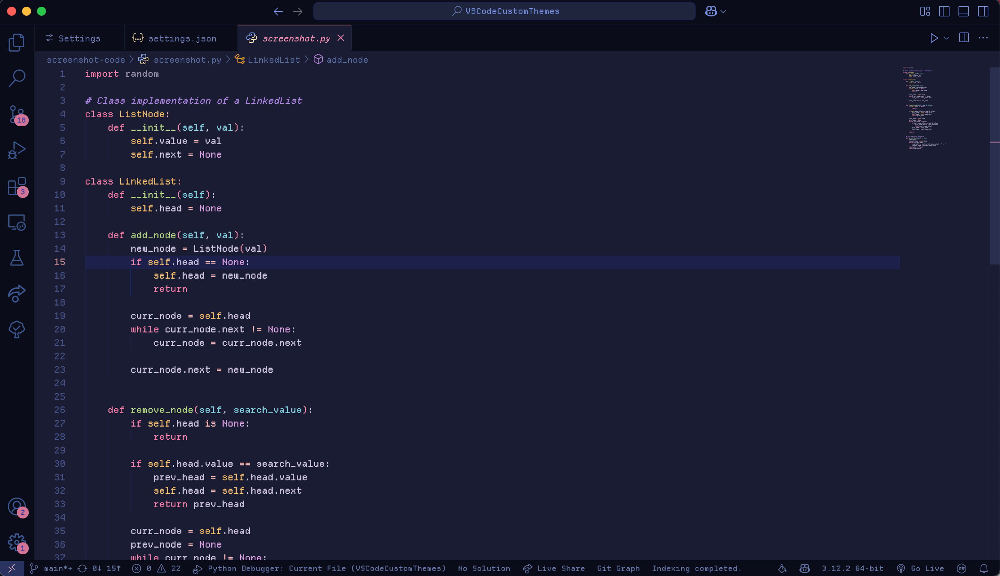
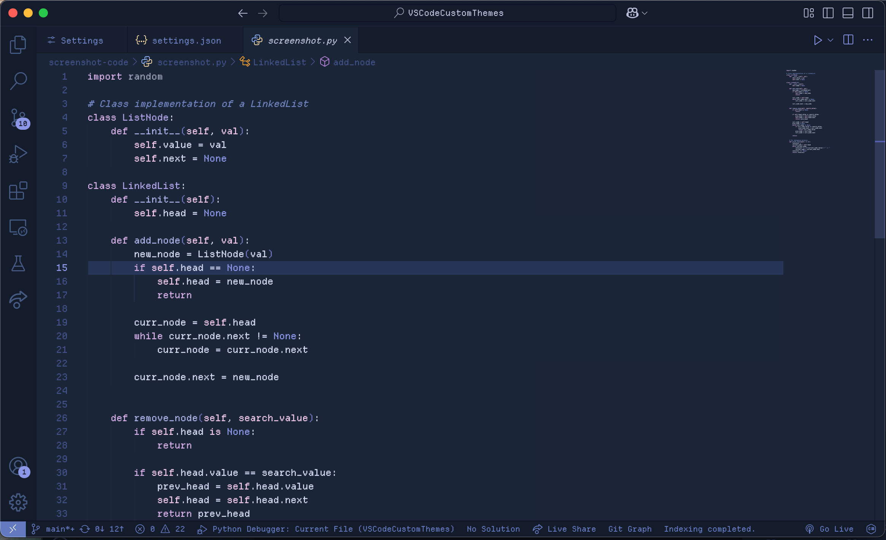
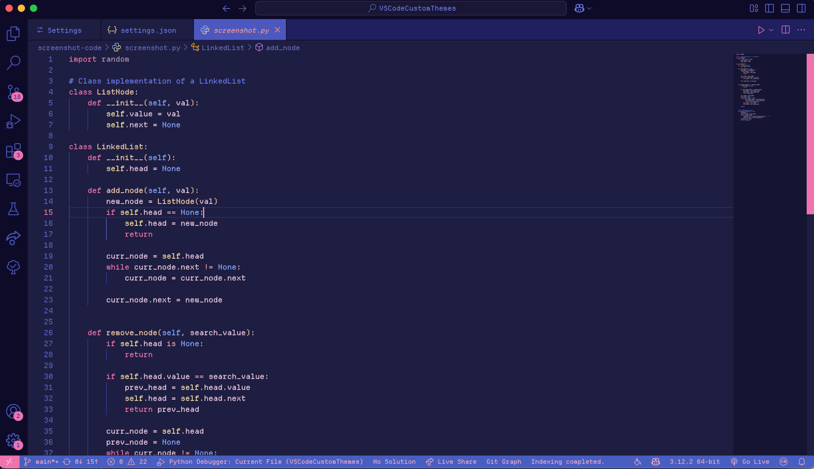

## About
This collection of themes aims to capture the common color schemes of citypop and lofi aesthetics. Currently, there are about 8 variations of dark themes with varying styles and palettes. 

## Previews

    
Default

    

    
Dawn

    

    
Day

    

    
Sunset

    

    
Dusk

    

    
Night

    

    
Midnight

    

    
Witching Hour

    

## Other Customizations
### Icons
1) Try out [Catppuccin Icons](https://marketplace.visualstudio.com/items?itemName=Catppuccin.catppuccin-vsc-icons) for VSCode!

### Font Settings
If you want to try programming fonts, [NerdFonts](https://www.nerdfonts.com/font-downloads) has many you can preview and download. Many of these fonts provide programming ligatures. However, if you don't want to go down the rabbit-hole of fonts, here are some I've found to be popular:

#### Ligature Support 
1. (Github) Popular one: [FiraCode](https://github.com/tonsky/FiraCode?tab=readme-ov-file)
2. (Website) Comes with 5 variations: [Monaspace](https://monaspace.githubnext.com/)
3. (Website) Another popular one: [Jetbrains Mono](https://www.jetbrains.com/lp/mono/)
4. (Github) Used in Visual Studio: [Cascadia Code](https://github.com/microsoft/cascadia-code)
5. (Github) A round, clean font similar to Cascadia Code: [Maple](https://github.com/subframe7536/maple-font)
6. (Github) If you like thin, tall letters: [Victor Mono](https://github.com/rubjo/victor-mono)

#### No Ligature Support 
1. (Website) **Recommended for this theme** (used in screenshots): [Departure Mono](https://departuremono.com/)
2. (Website) If you like small compact letters: [Mononoki](https://madmalik.github.io/mononoki/)

### Inspirations
1. Default: [Gruvbox](https://marketplace.visualstudio.com/items?itemName=jdinhlife.gruvbox) and [Catppuccin](https://marketplace.visualstudio.com/items?itemName=Catppuccin.catppuccin-vsc)
2. Dawn: [Blueberry Dark](https://marketplace.visualstudio.com/items?itemName=peymanslh.blueberry-dark-theme)
3. Day: [Pink Cat Boo](https://marketplace.visualstudio.com/items?itemName=ftsamoyed.theme-pink-cat-boo)
4. Dusk: [Gruvbox ish](https://marketplace.visualstudio.com/items?itemName=GracefulPotato.gruvbox-ish)
5. Sunset: [Monokai Pro](https://marketplace.visualstudio.com/items?itemName=monokai.theme-monokai-pro-vscode)
6. Midnight: [Tea House](https://marketplace.visualstudio.com/items?itemName=FireMegrez.thatteahousetheme)
7. Witching Hour: [Tokyo Night](https://marketplace.visualstudio.com/items?itemName=enkia.tokyo-night)

<!-- ### Default

### Dawn

### Day

### Sunset

### Dusk

### Night

### Midnight

### Witching Hour
 -->