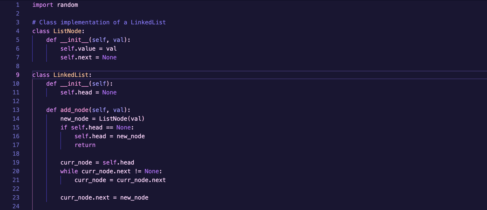
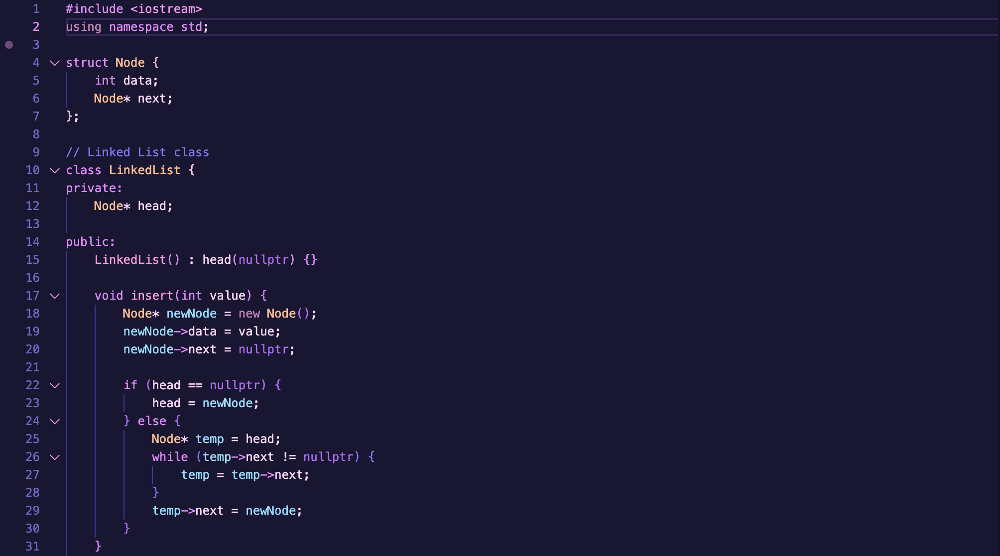
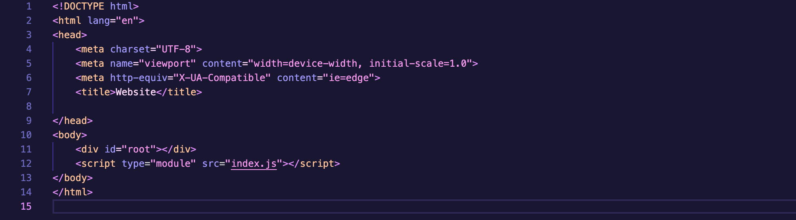
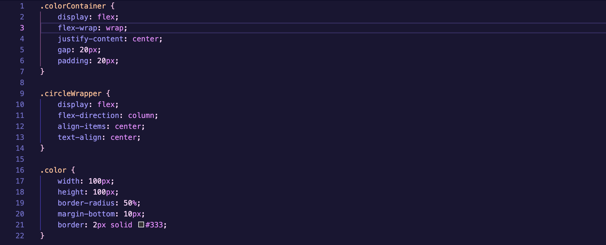

## About
This theme extension aims to capture the common color schemes of the citypop or lofi aesthetic. Currently, there are about 4 variations. Feel free to make suggestions or requests on the Issues tab on Github!

If you want to see some more themes I've made, you can see them all here!

## Previews

    
Default

    
Sunset

    
Night

        <h3>Python</h3>
        
        <h3>C++</h3>
        
        <h3>HTML</h3>
        
        <h3>CSS</h3>
        

## Recommended: 
1) Go to Settings -> Workbench -> Appearance -> ColorCustomizations
    a) Inside settings.json, set "editor.bracketPairColorization.enabled" : true
2) Download Catppuccin Icons for VSCode: https://marketplace.visualstudio.com/items?itemName=Catppuccin.catppuccin-vsc-icons